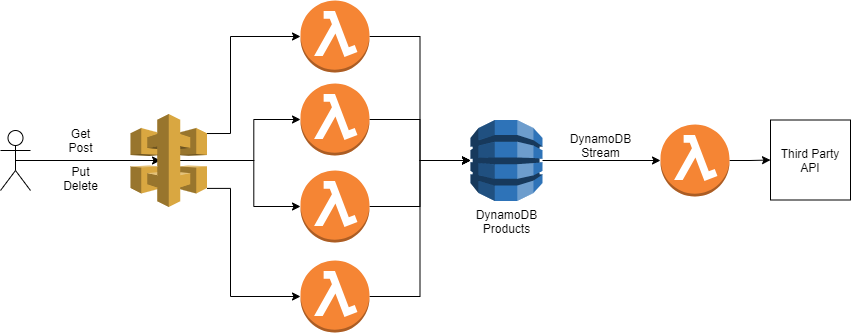

# Products API

This api was built using the serverless framework with:
* AWS Lambda Functions
* AWS API Gateway
* AWS DynamoDB
* AWS DynamoDB streams

For CRUD operations the lambda functions were chosen to split the responsibilities, be scalable and be more costly efficient. For the database, considering I would not use relational tables, I chose the DynamoDB. It is a performative NoSQL database, and it is possible to use the DynamoDB streams so we can propagate the changes to the third-party service. The DynamoDB Streams will keep trying to update the third-party service until it gets a successful answer.

The *OpenAPI documentation* cand be found [here](./gitHubAssets/dev-product-api-dev-oas30.yaml)

Next steps/improvements:
 - Calibrate the Provisioned read and write units on DynamoDB
 - Create some integration tests
 - Add the production stage in the configurations
 - Improve the logging to have a better tracing.
